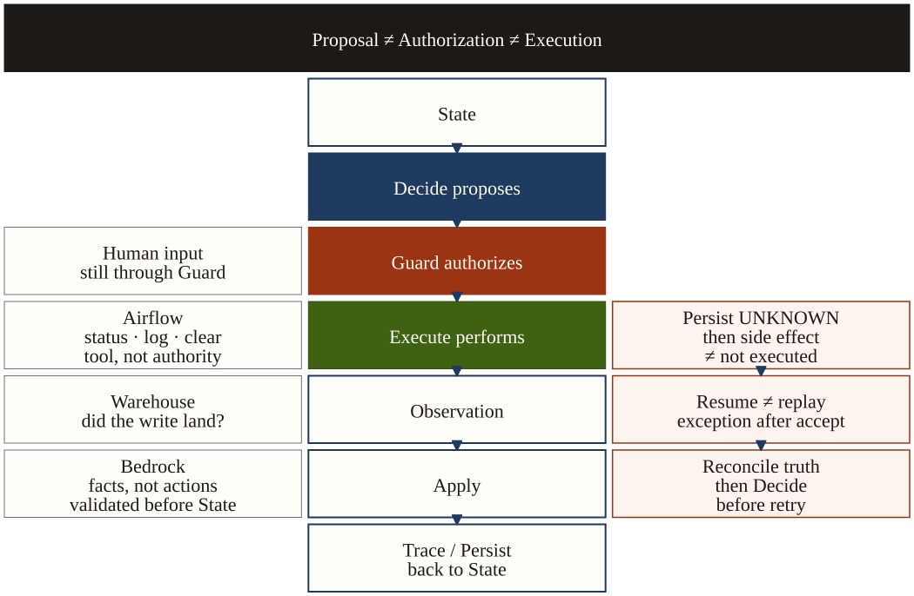

# Pipeline Reliability Agent

**The model may propose facts. It cannot authorize a side effect.**

A failed pipeline task is easy to retry and easy to corrupt. This agent investigates the failure, and a deterministic Guard is the only component that can authorize `RETRY` or `BACKFILL_PARTITION`. If the worker dies after a retry may already have been accepted, resume reads the external system before it does anything else.

This repository is a **production-style proof of work, not customer production**. The checked-in demos use a mock adapter, a local JSON ledger that records accepted clears, and a fake Bedrock Converse client. They do not call Airflow or AWS, and they do not measure production MTTR.

## 30-second problem

Retrying a task after rows were already written duplicates data. The harder case is uncertainty: the worker recorded an intent, the orchestrator may have accepted the clear, and the process died before the result was saved. That state is `UNKNOWN`. It is not the same as “the retry never ran.”

## Architecture



- The model may propose facts. It does not authorize a side effect.
- Deterministic Guard authorizes a side effect.
- Execute is the mutation boundary.
- `UNKNOWN` triggers reconciliation before another retry.

```text
State → decide → guard → execute → observation → apply → checkpoint
```

| Step | Owns | Must not |
|---|---|---|
| `decide()` | Propose the next action | Call a tool or write State |
| `guard()` | Authorize or deny | Think, do I/O, or mutate State |
| `execute()` | Perform the action | Decide policy |
| `apply()` | Merge the observation into State | Choose the next action |
| Bedrock | Propose a `FactProposal` | Authorize `RETRY`, `BACKFILL`, or `EXECUTE` |

`run_agent()` in `src/pipeline_reliability/runner.py` is the loop. Execute runs only when `guard()` returns `allowed=True`.

## Guardrails

Decide, Guard, and Execute are separate calls.

- A timeout with no prior retry makes `decide()` return `RETRY`.
- `guard()` asks `evaluate_retry_safety()`. Rows already written, a partial write, critical downstream impact, or an unresolved `UNKNOWN` side effect are denied.
- A denied `RETRY` never reaches the tool. The observation is `STOP_SAFE`.
- Human approval is an input. `approve()` stores `approved_action`. The next loop still calls `guard()` before Execute.

Guard’s hard checks are `RETRY`, `BACKFILL_PARTITION`, and `APPLY_APPROVED_REPAIR`. Other actions pass in this version.

## Crash and UNKNOWN

There is no `SIGKILL` in this proof. Worker A is allowed to retry, `record_retry_intent()` persists `retry_side_effect="UNKNOWN"` **before** the adapter call, the file ledger records the accept, and the worker then raises `CrashAfterRetryAccepted`. That is the window between intent and the result checkpoint.

Worker B is a new `run_agent()` on the same checkpoint and a new adapter on the same ledger.

```text
Checkpoint after the crash: retry_side_effect=UNKNOWN, orchestrator_status empty
Ledger retries: 1
Worker B actions: CHECK_ORCHESTRATOR_RUN → WAIT → CHECK_ORCHESTRATOR_RUN → STOP_SAFE
Ledger retries after resume: 1
Duplicate external writes: 0
```

`UNKNOWN` means the clear may have landed. A Guard denial is `not_executed`. An accepted mutation is `completed`. Resume checks first. It does not send the clear again while the side effect is still `UNKNOWN`.

## Reconcile

**RETRY.** Loading the checkpoint clears a stale orchestrator status when the side effect is `UNKNOWN`. The next action is `CHECK_ORCHESTRATOR_RUN`. Apply clears `UNKNOWN` only from evidence the clear landed: a new attempt or repair id, `SUCCESS`, or `RUNNING` when identity cannot prove it is still the old attempt. The same attempt still `FAILED` stays `UNKNOWN`.

**BACKFILL.** `reconcile_backfill()` is a read. It does not call `backfill_partition()`.

| Result | What Apply does |
|---|---|
| `LANDED` | Mark the partition `BACKFILLED`. Do not write again. |
| `NOT_LANDED` | Restore `ARRIVED` with an empty target. Guard may allow one new backfill. |
| `UNKNOWN` | Keep the intent. Pause for a human. Do not guess. |

## AWS Bedrock fact intelligence

`BedrockFactIntelligence` calls an injected `converse` client and returns a `FactProposal`. It does not write State, and it does not call Decide, Guard, or Execute. A response that contains tool use is rejected.

The validator accepts or rejects the proposal. Accepted facts may set allowlisted State fields, including `error="timeout"`. The next `decide()` already understands that field and may propose `RETRY`. `failure_type` and `confidence` are not written and do not select an action. Keys such as `RETRY`, `BACKFILL`, `EXECUTE`, and `authorization` are rejected by the existing validator.

If `retry_side_effect` is already `UNKNOWN`, the same accepted timeout facts still do not produce a retry. Guard would deny it.

The public demo and tests use a **fake Converse client**. No network call is made. This is not a live AWS production integration.

## Run the demos

Python 3.11+. No cloud account and no API key.

```bash
python -m venv .venv
source .venv/bin/activate
pip install -e ".[dev]"

python scripts/recovery_demo.py
python scripts/bedrock_reliability_demo.py
```

`recovery_demo.py` prints `Result: PASS` when the crashed retry is reconciled with zero duplicate clears.

`bedrock_reliability_demo.py` prints `client=fake  network=no  tools=none`. Scenario A lets Guard allow one safe retry after accepted timeout facts. Scenario B accepts the same facts and still refuses a second retry while the side effect is `UNKNOWN`.

A local mock run, with no model, stops instead of retrying when the warehouse already succeeded:

```bash
python -m pipeline_reliability
```

That command writes `.local/checkpoints/demo.json`. The adapter is `MockPipelineAdapter`.

## Evidence

```bash
python -m pytest -q
```

| Test | What it proves |
|---|---|
| `test_runner_does_not_execute_retry_after_guard_block` | Decide proposes `RETRY`. Guard denies it because rows exist. The tool does not run. |
| `test_human_approval_cannot_bypass_partial_write_guard` | A human `RETRY` approval still hits Guard. |
| `test_worker_b_reconciles_running_and_does_not_retry_again` | After `CrashAfterRetryAccepted`, resume checks and does not clear again. |
| `test_crash_reconcile_duplicate_external_writes_are_zero` | Duplicate external writes are 0. |
| `test_unknown_backfill_landed_reconciles_then_validates` | `LANDED` does not write again. |
| `test_unknown_backfill_not_landed_may_backfill_once_after_guard` | `NOT_LANDED` may backfill once, after Guard. |
| `test_unknown_backfill_unproven_asks_human_without_replay` | `UNKNOWN` asks a human and does not replay. |
| `test_unknown_side_effect_blocks_retry_after_accepted_timeout_facts` | Accepted Bedrock facts do not override an open `UNKNOWN`. |
| `test_retry_and_suggested_action_are_rejected_by_existing_validator` | Action and authorization keys never become State. |

`RunTrace` is the record of each step: action, Guard verdict, observation, and outcome.

## Boundary

Production-style proof of work, not customer production.

- Crash proof: exception after the ledger accepts, not a real `SIGKILL`.
- Bedrock proof: stubbed Converse, not a live AWS call.
- No production MTTR and no customer ROI.
- Airflow, BigQuery, Databricks, the API, Postgres, and the wake worker are not in this tree.
