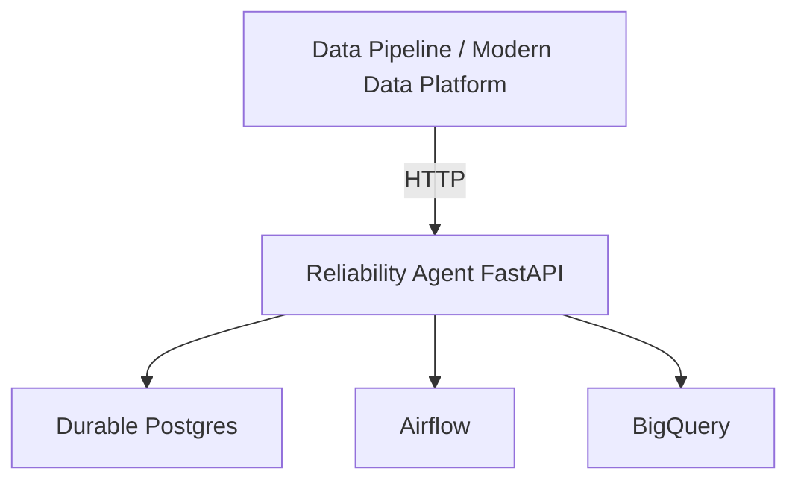
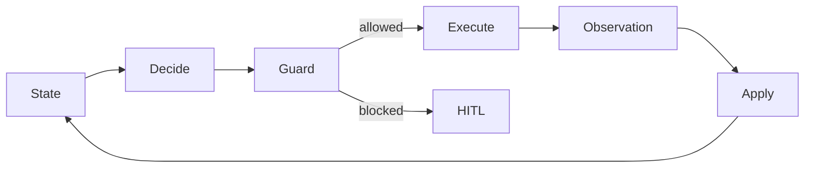
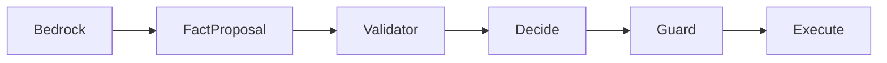

# Pipeline Reliability Agent

Production-style reliability control plane for data pipelines.

A failed pipeline is easy to retry and easy to corrupt. This control plane lets
an LLM propose a next step, then requires a deterministic Guard to authorize
it. The logical run is durable: a crash resumes the same run instead of
sending the mutation again. Completion waits for a fresh read of the external
system.

The code in this repository is a small runnable control loop with a synthetic
adapter. The proof sections summarize a local lab exercised against real
Airflow, BigQuery, and Postgres. That lab is not a fully production-deployed
enterprise platform, and not all five incidents passed.

## Architecture



The data platform calls the agent over HTTP. FastAPI stores the run in
Postgres, then reads and mutates Airflow and BigQuery. Guard stands between a
proposal and any external side effect.

## Core concepts

- **LLM proposes; deterministic Guard authorizes.** A model may summarize or propose. It cannot authorize a retry, bypass Guard, or call an adapter.
- **Durable state, checkpoint, and resume.** One `agent_run_id` survives pause, crash, and process restart.
- **UNKNOWN is not NOT_EXECUTED.** A lost response after dispatch means the side effect may already have happened.
- **Crash-safe reconciliation.** Resume re-reads external truth before any further mutation.
- **No blind duplicate mutation.** A second clear is refused while the first is unresolved or already observed.
- **Fresh external verification.** `COMPLETED` requires a new orchestrator or warehouse read, not a stale pre-mutation fact.
- **HITL / STOP_SAFE.** If safety cannot be proved, the run pauses for a human or stops without another write.

## Production proof

Five local lab incidents against real Airflow and BigQuery. Write-up:
[production reliability proof](docs/production_reliability_proof.md).

| Incident | Result | What the run showed |
|---|---|---|
| 1 | **PASS** | Real Airflow retry, then a fresh BigQuery read, then `COMPLETED`. |
| 2 | **PASS** | SIGKILL after retry dispatch. Durable `UNKNOWN`. Same `agent_run_id`. No second retry. Fresh BigQuery read. `COMPLETED`. |
| 3 | **GAP** | Execution succeeded. Required downstream data was still missing. Execution success is not data correctness. |
| 4 | **PARTIAL** | The late partition was backfilled. Correct partitions were not rewritten. Mixed-range validation and automatic completion are still incomplete. |
| 5 | **PASS** (safety property) | Schema drift was detected. The unsafe load was not performed. The run requested human review. |

Incidents 1, 2, and 5 passed the safety property under test. Incident 3 is an
open gap. Incident 4 is partial.

## Local Docker deployment proof

A separate lab run called a Dockerized FastAPI service over HTTP with bearer
authentication. The service used durable Postgres, real Airflow, and real
BigQuery.

The API container was restarted. Postgres stayed up. The same `agent_run_id`
was restored, the run resumed, and it reached `COMPLETED`.

This is a **local Docker deployment proof**. It is not a public-cloud or
enterprise production deployment. Detail:
[deployment demo](docs/deployment_demo.md).

## What this demonstrates

- End-to-end ownership of a reliability control plane, from the incident through external verification.
- Production failure thinking: timeouts, process death, stale evidence, incomplete data, and schema drift.
- Deterministic safety around an AI proposal boundary.
- Durable workflow design: one run id, checkpoint, reconcile, and resume.
- Real Airflow and BigQuery integration in the lab proof.
- Service deployment: HTTP, authentication, and a container restart that did not lose the run.
- Honest gaps. Semantic correctness and mixed-range completion are not solved.

## Runnable control loop

The rest of this repository is the deterministic loop behind those claims. It
runs locally with a synthetic adapter. No cloud account or credentials are
required. It is not a customer deployment and not evidence of reduced MTTR.



| Stage | Owns | Safety boundary |
|---|---|---|
| **State** | Incident snapshot, evidence epoch, retry intent | No hidden global facts |
| **Decide** | Pure action proposal | Cannot execute |
| **Guard** | Last-moment authorization | Re-checks lease, evidence freshness, retry budget |
| **Execute** | One adapter call | Persists UNKNOWN before RETRY dispatch |
| **Observation** | What the external system reported | Does not mutate State |
| **Apply** | Merges observed facts | Does not choose the next action |

## Safety contracts

| Risk | Contract |
|---|---|
| **UNKNOWN side effect** | A timeout after dispatch means the action may have happened. It does not mean the action failed safely. |
| **Retry** | RETRY needs fresh `EMPTY` evidence, a live lease and fencing token, and unused retry budget. |
| **Reconcile** | Every mutation invalidates pre-mutation evidence. UNKNOWN and lease takeover force a read before another action. |
| **HITL** | If safety cannot be proved, pause. Human approval is an input. Authorization still runs again immediately before execution. |

Policy:
[`agent.py`](src/pipeline_reliability/agent.py).
Compare-and-set lease and fencing token:
[`coordination.py`](src/pipeline_reliability/coordination.py).

## AWS Bedrock Integration

Bedrock provides intelligence, not authority. It may propose facts about a failed task. It cannot choose `RETRY` or `BACKFILL`, and it cannot call the adapter.



The validator rejects action fields. Accepted facts are evidence only. Decide and Guard stay deterministic. `UNKNOWN` is not `NOT_EXECUTED`: a lost response after dispatch still blocks another retry, and the run asks a human when recovery cannot be proved.

The demo and tests inject a fake Converse client. No AWS account, model ARN, or credentials are required. This is production-style proof of work, not a customer production deployment.

```bash
python -m pipeline_reliability.bedrock_demo
```

## One trace: retry response lost

The synthetic adapter commits the retry, then raises a transport timeout. The
agent records `UNKNOWN`, reconciles, finds the commit, and stops without a
second retry:

```text
INSPECT   -> EMPTY
RETRY     -> UNKNOWN (response lost after dispatch)
RECONCILE -> COMMITTED
STOP_SAFE -> retry_calls=1
```

Full record: [stale-retry.trace.jsonl](examples/stale-retry.trace.jsonl).

## Engineering casebooks

- [Stale evidence after retry](docs/casebooks/01-stale-evidence-after-retry.md) — pre-mutation reads cannot authorize a later mutation.
- [Multi-worker atomic claim](docs/casebooks/02-multi-worker-atomic-claim.md) — one incident, one active owner.
- [Lease takeover and reconcile after crash](docs/casebooks/03-lease-takeover-reconcile.md) — fence the old worker and force a fresh read.

Each casebook states the failure, the invariant, the implementation decision,
the evidence in this repo, and the remaining production gap. The lab incidents
above are the external proof; these casebooks are the local invariants.

## Run locally

Python 3.11+. No cloud account, credentials, database, or API key.

```bash
python -m venv .venv
source .venv/bin/activate
pip install -e ".[dev]"
python -m pipeline_reliability
pytest
```

Expected:

```text
10 passed
```

Four tests map to the three casebooks plus one explicit Guard rejection. Six more cover the Bedrock fact adapter with a fake client.

## Repository map

```text
src/pipeline_reliability/
  model.py          # state, actions, observations
  agent.py          # Decide, Guard, Execute, Apply, synthetic adapter
  bedrock.py        # Bedrock fact adapter; proposes facts, not actions
  bedrock_demo.py   # two-scenario fake-client demo
  coordination.py   # atomic lease claim and fencing token
tests/
  test_safety_contracts.py
  test_bedrock_facts.py
docs/
  production_reliability_proof.md
  deployment_demo.md
  casebooks/
examples/
  stale-retry.trace.jsonl
```

## Honest limitations

- The runnable `LeaseStore` is process-local. A shared store needs transactional compare-and-set and durable fencing tokens. The lab crash and deployment proofs used Postgres for the runs described in the docs. That store is not shipped here.
- State in this repository is in memory. Production persists the checkpoint before dispatch and requires an idempotency key the downstream system accepts.
- The adapter in this repository is synthetic. Lab runs summarized in the proof docs used local Airflow, BigQuery, and Postgres. Those credentials and raw artifacts are not in this repo.
- HITL here is a safe terminal outcome. It is not an approval UI, SSO, RBAC, or an auditable workflow. Same-run resume after human repair is not supported.
- The local policy uses one bounded retry so the proof stays legible. A real policy has to be service-specific and rate-aware.
- Incident 3 shows the semantic gap: a successful job can still write the wrong rows. Incident 4 does not automatically finish a mixed partition range.
- Tests demonstrate local invariants. They do not demonstrate distributed correctness, availability, throughput, or business impact.
- The Docker proof is local. There is no public-cloud hosting, managed production database, or enterprise deployment claim.

## License

MIT.
