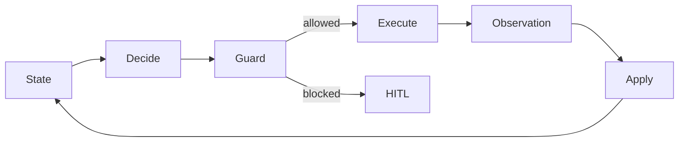

# Pipeline Reliability Agent

A compact proof of work for **production data systems + AI agent reliability**.

The hard question after a pipeline failure is rarely “can we retry?” It is
“can we prove that retrying will not duplicate or corrupt data?” This repo
shows a small, deterministic control loop that treats missing evidence,
concurrency, and crash recovery as first-class safety problems.

> **Scope:** runnable, synthetic reference code. It is not production-ready,
> not a customer deployment, and not evidence of reduced MTTR.

## The 3-minute path

1. Read the failure mode and six-stage loop below.
2. Scan the four safety contracts.
3. Open the three short [Engineering Casebooks](#engineering-casebooks).
4. Run the trace and four targeted tests.

## Problem

An orchestrator can report failure after a warehouse commit already succeeded.
A network timeout can hide whether a retry request was accepted. Two workers
can race on the same incident. A replacement worker can inherit a stale
checkpoint after a crash.

A naive “retry failed tasks” agent can therefore create the incident it was
meant to fix.

This design separates a proposed action from authorization and execution:



| Stage | Owns | Safety boundary |
|---|---|---|
| **State** | Small incident snapshot, evidence epoch, retry intent | No hidden global facts |
| **Decide** | Pure action proposal | Cannot execute |
| **Guard** | Last-moment authorization | Re-checks lease, evidence freshness, retry budget |
| **Execute** | One adapter call | Persists UNKNOWN before RETRY dispatch |
| **Observation** | What the external system reported | Does not mutate State |
| **Apply** | Merges observed facts | Does not choose the next action |

The optional AI/LLM boundary is intentionally narrow: a model may summarize or
propose evidence, but it cannot authorize `RETRY`, bypass Guard, or call an
adapter.

## Safety contracts

| Risk | Contract |
|---|---|
| **UNKNOWN side effect** | A timeout after dispatch means “may have happened,” never “failed safely.” |
| **Retry** | RETRY needs fresh `EMPTY` evidence, a live lease/fencing token, and unused retry budget. |
| **Reconcile** | Every mutation invalidates pre-mutation evidence. UNKNOWN and lease takeover force a read before another action. |
| **HITL** | If safety cannot be proved, pause. Human approval is an input; a production design must still re-run authorization immediately before execution. |

The core policy is in
[`agent.py`](src/pipeline_reliability/agent.py); the compare-and-set lease and
fencing-token example is in
[`coordination.py`](src/pipeline_reliability/coordination.py).

## One trace: retry response lost

The synthetic adapter commits the retry, then raises a transport timeout. The
agent records `UNKNOWN`, reconciles, finds the commit, and stops without a
second retry:

```text
INSPECT   -> EMPTY
RETRY     -> UNKNOWN (response lost after dispatch)
RECONCILE -> COMMITTED
STOP_SAFE -> retry_calls=1
```

See the [full JSONL trace](examples/stale-retry.trace.jsonl).

## Engineering Casebooks

- [Stale evidence after retry](docs/casebooks/01-stale-evidence-after-retry.md)
  — why pre-mutation reads must be invalidated.
- [Multi-worker atomic claim](docs/casebooks/02-multi-worker-atomic-claim.md)
  — one incident, one active owner.
- [Lease takeover + reconcile after crash](docs/casebooks/03-lease-takeover-reconcile.md)
  — fencing the old worker and forcing a fresh read.

Each casebook states the failure, invariant, implementation decision, evidence,
and remaining production gap.

## Run locally

Python 3.11+; no cloud account, credentials, database, or API key required.

```bash
python -m venv .venv
source .venv/bin/activate
pip install -e ".[dev]"
python -m pipeline_reliability
pytest
```

Expected test result:

```text
4 passed
```

The tests are intentionally small and map directly to the three casebooks plus
one explicit Guard rejection.

## Repository map

```text
src/pipeline_reliability/
  model.py          # state, actions, observations
  agent.py          # Decide, Guard, Execute, Apply, synthetic demo adapter
  coordination.py   # atomic lease claim + fencing token
tests/
  test_safety_contracts.py
docs/casebooks/
examples/
  stale-retry.trace.jsonl
```

## Honest limitations

- `LeaseStore` is process-local; production needs a transactional shared store
  with compare-and-set semantics and durable fencing tokens.
- State and retry intent are in memory; production needs atomic persistence
  before dispatch and an idempotency key accepted by the downstream system.
- The adapter is synthetic. There are no Airflow, GCS, warehouse, cloud, or
  customer credentials in this repo.
- HITL is represented as a safe terminal outcome, not a shipped approval UI,
  SSO/RBAC system, or auditable workflow.
- The policy uses one bounded retry to keep the proof legible. Real retry
  policy must be service-specific, rate-aware, and backed by measured failure
  modes.
- Tests demonstrate local invariants, not distributed-system correctness,
  availability, throughput, production readiness, or business impact.

## License

MIT.
