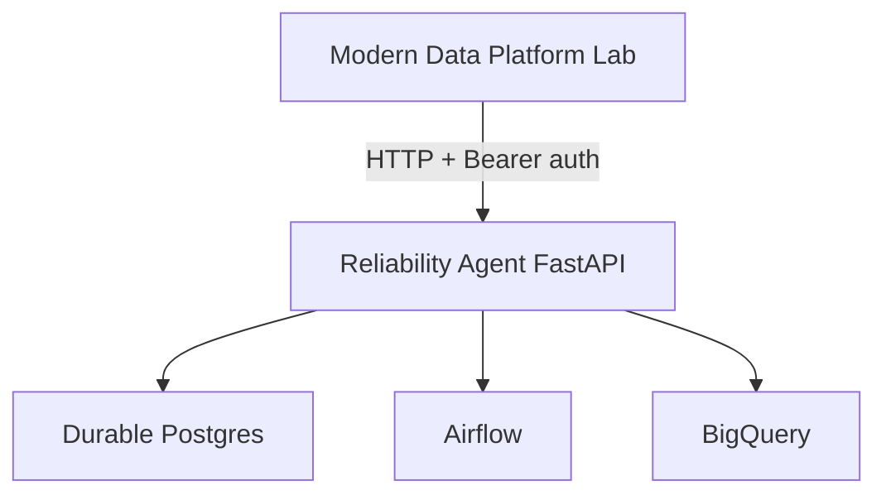
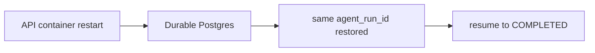

# Local Docker deployment proof

The lab called a separately deployed Reliability Agent over HTTP. This is a
local Docker deployment proof. It is not a public-cloud or enterprise
production deployment.

It is also not one of the five incident-casebook runs. Those verdicts are in
[production reliability proof](production_reliability_proof.md) and are
unchanged by this demo.

## Architecture



The API container is replaceable. Postgres holds the logical run.



The agent listened on its own host port. Airflow already owned the usual
orchestrator port.

## What was validated

```text
Modern Data Platform Lab
  → HTTP + Bearer auth
  → Dockerized FastAPI service
  → durable Postgres
  → real Airflow
  → real BigQuery
```

Checked behavior:

1. Process health and Postgres readiness both returned success before the run.
2. A missing bearer credential was rejected. A valid credential against an unknown run id was not treated as success.
3. Creating a run returned an accepted, waiting status after one Airflow clear.
4. Only the API container was restarted. Postgres stayed up.
5. A read of the same `agent_run_id` matched the pre-restart snapshot.
6. After the new Airflow attempt succeeded, resume used that same id.
7. The final snapshot was `COMPLETED` after a fresh BigQuery read reported success.

The bearer credential and database connection lived in the environment for
that lab run. They are not in this repository.

## What the restart proves

Replacing the API process did not mint a new logical run and did not send a
second clear. The run id, waiting status, and version were still in Postgres.
Resume continued that run to `COMPLETED`.

The BigQuery proof is the agent's fresh job read, stored as success. This
demo does not claim a populated row count.

## What this does not prove

- A public or cloud deployment.
- Kubernetes, a managed production database, or enterprise rollout.
- That every incident-casebook scenario passed.
- Semantic row validation or mixed-range completion. Those remain the Incident 3 gap and the Incident 4 partial result.
